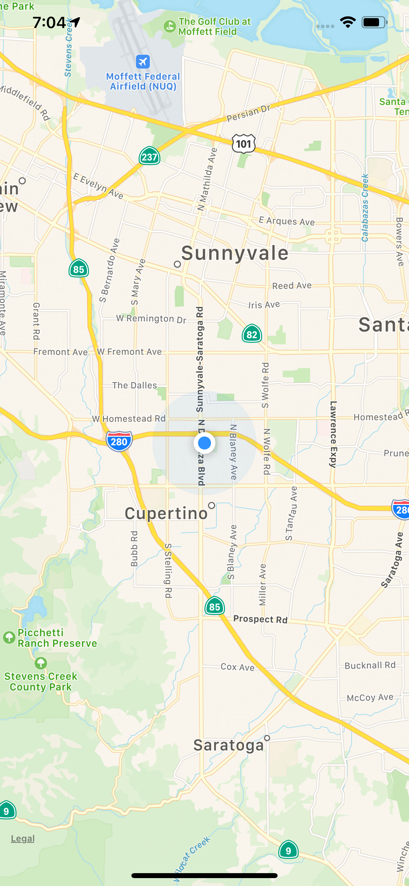

# Showing the users location on a map

In this snippet, I display the users location on a map view using ```MapKit``` and ```CoreLocation```.

## Tech Specs

- iOS 12.2
- Swift 5

<p align="center">
  
</p>